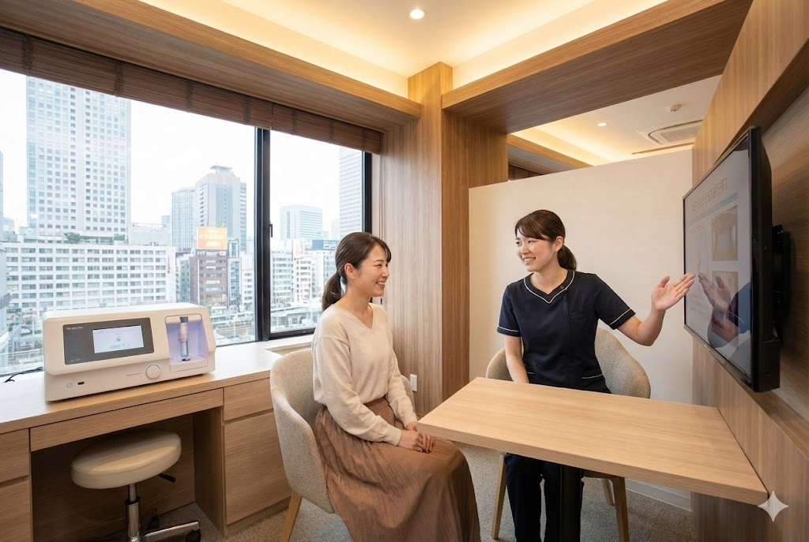

# ブレスケアクリニック LP（テスト用）

口臭治療クリニックのランディングページテンプレート

## 📁 ディレクトリ構成

```
breathcare-lp/
├── index.html          # メインHTML
├── css/
│   └── styles.css      # スタイルシート
├── js/
│   └── script.js       # JavaScript
├── images/             # 画像フォルダ（空）
│   └── .gitkeep
└── README.md           # このファイル
```

## 🚀 使い方

### ローカル確認

1. `index.html` をブラウザで開く
2. または Live Server 等の拡張機能を使用

### 本番デプロイ

1. 画像を `images/` フォルダに配置
2. `index.html` 内の画像プレースホルダーを実際の `` タグに置換
3. 電話番号・住所を実際の情報に変更
4. フォーム送信先を設定

## 🎨 カスタマイズ

### カラー変更

`css/styles.css` の `:root` 内のCSS変数を変更

```css
:root {
  /* メインカラー */
  --color-primary: #1B5E5E;
  --color-primary-light: #E8F5F5;
  --color-primary-dark: #0D3D3D;
  
  /* アクセントカラー */
  --color-accent: #C9A962;
  --color-accent-light: #FBF7ED;
}
```

### フォント変更

`index.html` の Google Fonts リンクと、`css/styles.css` の `--font-main` / `--font-serif` を変更

### スペース・角丸・シャドウ

```css
:root {
  /* スペース */
  --space-md: 16px;
  --space-lg: 24px;
  
  /* 角丸 */
  --radius-md: 12px;
  --radius-lg: 20px;
  
  /* シャドウ */
  --shadow-md: 0 4px 16px rgba(0, 0, 0, 0.08);
}
```

## 📱 レスポンシブ対応

| ブレークポイント | 対象デバイス |
|-----------------|-------------|
| 〜599px | モバイル |
| 600px〜899px | タブレット |
| 900px〜1199px | PC |
| 1200px〜 | ワイドPC |

## ✨ 実装機能

- [x] モバイルファースト設計
- [x] PC対応（横並びレイアウト）
- [x] スクロールアニメーション（Intersection Observer）
- [x] FAQアコーディオン
- [x] 固定フッターCTA
- [x] スムーススクロール
- [x] フォームバリデーション
- [x] Google Map埋め込み

## 📝 画像差し替え方法

現在はプレースホルダーになっている箇所を実際の画像に置換

```html
<!-- Before: プレースホルダー -->
<div class="img-placeholder">
  <span class="img-placeholder__text">メイン画像</span>
</div>

<!-- After: 実際の画像 -->

```

### 必要な画像一覧

| 用途 | 推奨サイズ | ファイル名（例） |
|------|-----------|----------------|
| FVメイン | 1200×800px | main-visual.jpg |
| 安心ポイント×3 | 800×500px | reason-01.jpg |
| 比較イラスト | 1000×600px | comparison.png |
| Before/After | 800×500px | transformation.jpg |
| 設備×3 | 600×400px | equipment-01.jpg |
| OGP画像 | 1200×630px | ogp.jpg |
| ファビコン | 32×32px | favicon.ico |

## 🔧 変更が必要な箇所

| 項目 | ファイル | 現在の値 |
|------|---------|---------|
| クリニック名 | index.html | ブレスケアクリニック |
| 電話番号 | index.html | 0120-000-000 |
| 住所 | index.html | 東京都新宿区新宿3-1-1 サンプルビル5F |
| Google Map | index.html | 新宿駅周辺のダミー |
| フォーム送信先 | index.html | action="#" |
| プライバシーポリシーURL | index.html | href="#" |

## 📄 ライセンス

テスト・学習目的での使用を想定しています。

## 🛠 技術スタック

- HTML5（セマンティック）
- CSS3（CSS Variables / Flexbox / Grid）
- Vanilla JavaScript（ES6+）
- Google Fonts（Noto Sans JP / Shippori Mincho）
